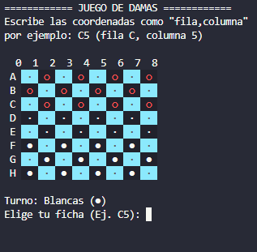

# JUEGO DE DAMAS EN TERMINAL

## Descripción

Proyecto de juego de damas, producto jugable desde la terminal gracias a [Node.js](https://nodejs.org/es)
el archivo contempla la mayoria de las funciones del juego basico de las damas, para más conprension de las
reglas impuestas [Reglas](./Reglas.txt).

### Juego de damas imagen



## Tecnologias usadas & Run

- [Node.js](https://nodejs.org/es)

"> version utilizada v24.20.0"

1. Run Damas.j

```bash

node Damas.js

```

## Autor

| [<br><sub>Mrimiir</sub>](https://github.com/Mrimiir) | :---: |
